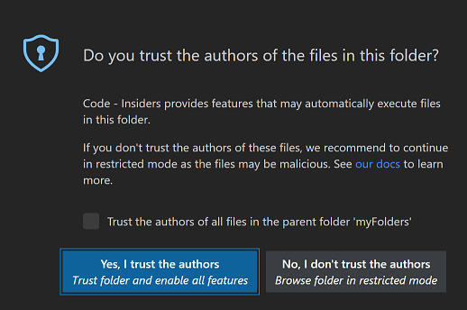
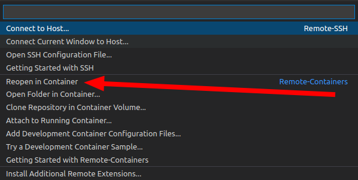

# UGain - containers and Kubernetes introduction

This repository contains the necessary files to run the lab session about (Docker) containers and Kubernetes.

## Getting started

1. Clone this repository to your computer using git.
1. Open `lab-containers.code-workspace` using Visual Studio Code.
1. Choose "Yes, I trust the authors", so VSCode enables regular mode.

   

1. Click on the "Remote" icon on the bottom left of VSCode.

   

   1. Choose the option "Reopen in container" from the command palette.

      

   1. The container will be automatically created based on the configuration included in the lab files.
1. Wait until the containers are set up. This can take a few minutes because the container needs to be pulled and built. You can check the progress by clicking "Starting Dev Container (show log)" in the notification on the bottom right of VSCode.
1.  When the containers are setup, **open `lab-containers.md`** and follow the instructions. When finished **open `lab-kubernetes`** to get an introduction to Kubernetes.

## Copyright

You can use and modify this lab as part of your education, but you are not allowed to share this lab, your modifications, and your solutions. Please contact the teaching staff if you want to use (part of) this lab for teaching other courses.

Copyright © teaching staff of the course "Machine Learning into Practice: Deep Dive into MLOps" at the Faculty of Engineering and Architecture - Ghent University.
